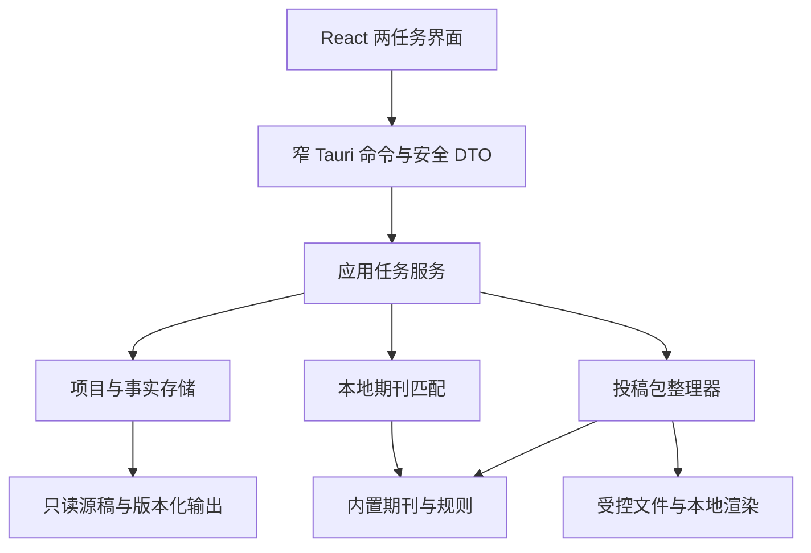

# 目标架构与代码目录

- 状态：部分实现的目标设计，2026-09-14；实际目录与未完成差异以本文件和 [V0.54 状态](../releases/V0.54/implementation-status.md)为准。
- 范围：[实现总览](README.md)；接口与失效规则见[合同与状态](contracts-and-state.md)。

## 1. 审查基线与重构结论

当前 `App.tsx` 约 3,225 行，桌面命令入口约 2,706 行，`workspace.rs` 约 11,065 行（包含测试）。后者混合源稿、推荐、资料、知识体、存证、投稿及导出。目标选择的数据结构含必填 `recommendation_run_id`，与独立整理入口冲突。

因此重建 UI 路由、应用服务、目标选择与文件编译合同；不沿旧页面逐项隐藏入口，不在旧工作区类中继续堆新分支。规模数字仅为本次源码快照，不作为删除或质量阈值。

继续一个 Rust 核心 crate 和一个 Tauri 应用，不为两个任务创建微服务、多进程后台平台或多个发布包。外部文档渲染器如采用，只是按需启动的本地受控子进程。

## 2. 新运行边界



UI 只持有用户编辑草稿和服务端视图，不复制一个与 Rust 竞争的“是否能导出”状态机。Rust 返回可用动作、缺项、运行任务和当前输出状态；UI 负责展示和把明确动作发送给服务。

## 3. 目标源码树与当前落地

```text
apps/desktop/src/
  app/                 AppShell、任务路由、最近项目、恢复入口
  features/
    files/             文件与文件夹选择清单
    matching/          偏好表单、最多三张候选卡片
    preparation/       目标、缺项、字段与附件补充
    package/           真实文件预览、差异和保存结果
  shared/
    contracts/         IPC DTO、错误码、事件类型
    ipc/               invoke 包装、任务订阅、过期响应处理
    ui/                按钮、表单、详情面板、可访问反馈
  i18n.tsx             沿用现有双语入口，精简无调用文案
  typography.css       保留有用阅读规则

apps/desktop/src-tauri/src/
  lib.rs               应用装配，不承载业务
  commands/            projects、files、journals、preparation、exports
  services/            任务调度、原生选择、受控打开与本地渲染进程
  window_geometry/     保留验证有效的原生窗口恢复
  ui_preferences.rs    保留设置与字号

crates/manuscript-core/src/
  domain/              Project、DocumentFacts、Target、PackagePlan
  projects/            存储、不可变版本、最近任务隐藏与恢复
  documents/           DOCX 读取、对象定位、有限安全变换
  journals/            内置目录、身份归并、机构名单、匹配
  rules/               加载、继承、适用性、检查、证据
  preparation/         事实输入、声明、附件绑定、待办投影
  compiler/            计划、生成器、匿名检查、输出验证、导出
  audit/               输入与输出指纹、变更和结果记录

crates/manuscript-core/
  rule-packs/          复用现有规则资源，新增已核验期刊差异
  journal-data/        catalog.json 与期刊索引（规划新增）
  templates/           审核过的 DOCX 模板及语言资源（规划新增）
  tests/fixtures/      小型合成 OOXML／目录／历史 schema 样例
tests/desktop/         两任务原生验收方案与脚本（有实现后创建）
```

不为单一桌面产品激活 `packages/ui` 和 `packages/contracts` 空包。新 DTO 暂放前端 shared；未来有第二个消费者再决定提取包。未被构建引用的空壳目录可删除，见删除清单。

V0.54 当前采用同一边界但保持较小的平铺模块：前端为 `App.tsx`、`shared/contracts.ts`、`shared/ipc.ts` 与双语入口；Tauri 命令暂集中在 `src-tauri/src/lib.rs`；核心为 `domain.rs`、`projects.rs`、`documents.rs`、`journals.rs`、`preparation.rs` 和 `compiler.rs`。这不是尚未创建目录的假实现；后续只有在模块继续增长时才按上面的目标树机械拆分，不以拆目录本身关闭工作包。

## 4. 存储策略

项目事实使用版本化 JSON 和不可变文件。V0.54 没有引入 SQLite；最近任务仍从项目 manifest 扫描并排序，另以单一 `recent-hidden.json` 集合记录可恢复的列表隐藏状态，不复制项目事实也不删除项目文件。不将 UI 路由持久化为业务事实。

```text
<应用数据目录>/workspace-next/
  folders/<folder-hash>.json  Rust 专有的规范化文件夹路径与项目绑定；不投影到 WebView
  projects/<project-id>/
    manifest.json            当前 schema、来源、事实、目标与最近任务
    sources/<version-id>/    原稿只读副本与内容哈希
    materials/<file-id>/     作者选择的附件副本
    staging/<package-id>/    当前生成物与审计记录
  requests/<request-id>.json
  jobs/<job-id>.json
  packages/<package-id>.json
  receipts/<receipt-id>.json
  recent-hidden.json         仅记录可恢复的首页隐藏项目 ID
  locks/                     跨进程文件锁
```

`workspace-next` 已作为新 schema 根，避免旧客户端误读；新版运行时不扫描或读取旧 `workspace/`，也不提供旧任务导入。应用 Bundle ID 与安装名保持不变，磁盘上已有旧文件不被主动清理。

文件副本先写临时文件、校验并原子提交；项目级单写者或锁串行提交，更新携带预期 revision。SQLite 索引失败可从 manifest 重建，不宣称项目丢失。持久化错误返回失败，不能仅更新 UI。

打开、附件复制和编译时验证快照大小与哈希；当前实现仍会把允许上限内的输入读入内存计算哈希，流式哈希是扩大文件上限前的剩余项。原生文件选择产生短期受控 token，不能把完整路径作为任意 IPC 参数。作者选择的输出目录由后端授权表持有；WebView 返回的文件 ID 只能定位当前项目或当前生成结果。

## 5. 文件夹与资源限额

建议初始工程限额：PDF 当前限制 50 MiB 和 2,000,000 个提取字符；DOCX 单稿沿用现有 250 MiB；一次最多 200 个材料文件、总量 1 GiB。DOCX 容器最多 10,000 项、展开总量 1 GiB、单 XML 32 MiB。最终值须以正常样本和异常样本校准并集中配置，不能把这些初值当发布能力证明。

首版只加载所选目录直接子文件，不递归子文件夹。排除临时／隐藏文件并说明数量；多主稿需作者选择。同一个规范化目录以哈希绑定到唯一项目 ID，再次选择只刷新该记录；选择内容不同的主稿会新增不可变 source version，旧快照保留。未变化的同名、同用途、同哈希附件不重复复制。后续导出默认在原文件夹中创建带版本标识的 `ManuscriptDock-*` 子目录，不覆盖输入。规范化绝对路径只保存在 Rust 所有的绑定记录里，前端仅接收短期 token、文件夹名和不含路径的 binding ID。拒绝路径穿越、符号链接越界、重复 ZIP 条目、加密包及压缩炸弹，取消和超限不留下半个有效项目。

后台最多一个文档编译任务，轻量检索可并行；不要同时启动多个渲染器竞争 Office 配置或内存。CPU 密集工作离开 UI／异步网络执行线程；取消后只清理本任务暂存目录。

## 6. 依赖策略与离线约束

- 先复用现有 `quick-xml`、`zip`、`serde`、`sha2`、`pdf-extract` 及签名验证，不另造 ZIP、PDF 和 XML 解析器。
- 新增输出或嵌入库前记录平台、许可证、体积、启动成本、维护与离线分发方式；不为方案先安装依赖。
- 删除远程模型与网页抓取代码后，核对 `reqwest`、`keyring`、`url`、`scraper` 等真实调用，再移除无用依赖；`tokio` 等可能仍支撑任务，不按名称盲删。
- 发布 CSP 与开发 CSP 分开核对，开发热更新地址不能残留为发布版任意网络通道。
- 原稿中的远程关系不允许在解析或预览时自动请求；只读链接文本与打开受控网页是不同权限。
- 核心不建立 HTTP 服务、不下载规则、不接入云模型；维护公开规则的开发工具不进入应用运行依赖。

## 7. 设计完成标准

新 UI、命令、业务服务与持久化各有单一职责；一个已知 journal ID 可以从空任务直接走到准备清单。一个无云配置的离线安装可以完成两条路径。导出仅依赖当前项目、目标、规则、作者事实与材料，不依赖知识体或投稿登记。模块拆分是否值得保留以调用图和测试为据，不以目录数量为目标。
