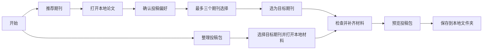

# 本地选刊与投稿包整理：产品收敛实施方案

- 日期：2026-09-14
- 状态：方向已确认；本次交付为方案与文档，功能待实施。
- 方案基线版本：投稿舱 ManuscriptDock V0.52；后续实际用户可见实现已递增为 V0.54，见 [实现状态](releases/V0.54/implementation-status.md)。
- 工作分支：`codex/local-journal-package-plan`
- 定义：[产品设计总纲](product-design-overview.md)
- 交互：[简洁交互设计](ui-design-direction.md)
- 决策：[ADR 0010](adr/0010-local-journal-package-focus.md)

详细技术执行已拆至[实现目录](implementation/README.md)：数据／IPC、文件整理器、模块删除、W01—W14 工作包和验收均在那里维护。本文件继续负责范围与 P0—P5 总览。文档目录迁移见[文档结构](documentation-structure.md)。

## 1. 本轮确认的四项要求

1. 交互简单：每屏只处理一个主要决定，不让作者理解内部状态机。
2. 产品只有两个核心功能：推荐期刊；根据目标期刊要求整理投稿包。
3. 期刊要求可由 AI 辅助读取官网或参考其他投稿网站形成初版，经人工核验、维护、测试后内置客户端。
4. 本地输入使用“选择／打开／加载本地文件（夹）”，不以“上传论文”组织界面。

补充决定：人工维护先不做成功能。团队直接在仓库内维护期刊配置，随客户端版本发布；不建设维护后台、客户端规则编辑器、PWC 规则平台或独立规则更新服务。

实现授权更新：可以重写全部旧代码、接口与交互，直接删除无用模块；不要求旧页面、命令或知识体模型兼容。只保留对两个核心任务有价值的能力。由于早期版本尚未上线，旧任务数据不再扫描、展示或迁移；应用不主动删除磁盘上的原稿和既有输出。具体见[重写与删除清单](implementation/rewrite-and-removal.md)和 [ADR 0011](adr/0011-rebuild-core-and-retire-legacy-flows.md)。

本文件记录从 V0.52 出发的产品方案，不表示 V0.52 已实现新流程；后续实现事实、测试数量和仍待验边界以 V0.54 实现状态为准。

## 2. 两条独立可用、共享材料的路径



- 首页两个入口，进入某一任务后每屏只有一个主要操作。最近打开的论文作为次要入口。
- 推荐不是整理投稿包的前置条件；作者可搜索内置目录直接选定期刊。
- 推荐后进入整理时沿用论文、已确认信息和目标，不重新选择相同文件或回答相同问题。
- “结构提取、规则组合、版本快照、重新检查”是后台动作，不分别成为导航步骤。
- 不用聊天框承载主流程，不要求登录、API Key 或云端工作区。
- 默认只处理一个当前目标；改变目标不会形成并行投稿，也不会覆盖历史输出。

## 3. 输入与本地工作方式

| 输入 | 新版首批支持目标 | 边界 |
| --- | --- | --- |
| DOCX 主稿 | 推荐与整理投稿包 | 保存内部只读副本，生成物另存；不能承诺任意 DOCX 都可安全改写 |
| 本地材料文件夹 | 为整理任务加载主稿及附件，并作为长期项目工作区 | 同一规范化文件夹对应同一记录；展示文件清单；多个主稿候选时由作者选定，不静默采用第一个 |
| XLSX 机构名单 | 作为选刊条件 | 只读已保存值，不执行公式、宏和外链；确认名单用途、年份及 ISSN 匹配 |
| PDF | 可保留现有本地查看／有限推荐路径 | 不进入新版投稿包生成承诺；提示打开对应 DOCX，不承诺转换回 Word |
| LaTeX | 兼容已有记录，不扩大功能 | 不纳入新版首批验收，不删除历史源文件 |

文件夹首版默认只列所选目录的直接子文件；包含子文件夹需作者显式选择。忽略隐藏文件、临时文件及不支持类型，并显示跳过数量；不追随指向授权目录外的符号链接。文件数量和总大小在实现前定义限额，超限给出重新选择入口。

加载附件不等于全部纳入输出：先建议文件用途，无法判断时标为“请选择用途”；同名或重复文件不静默覆盖。材料加载结果在同一页可核对，普通操作不重复弹确认框。

Rust 持有真实路径和授权句柄，WebView 只接收安全元数据与受控标识。“在文件夹中显示”通过窄命令打开系统文件管理器，不放开前端任意路径读写。

取消文件选择保持原页面；文件损坏、被移动或格式不支持提供直接恢复操作。重新打开外部修改稿时创建新快照；无需后台持续监听整个磁盘。

## 4. 推荐期刊合同

### 4.1 一页投稿偏好

本地解析后预填标题、摘要、关键词、语言和文章类型，仅突出不确定项，作者可直接纠正。随后在一页内呈现五组条件，非必要内容折叠：

| 条件组 | 最少输入 | 需要时展开 |
| --- | --- | --- |
| 目标倾向 | 进阶／均衡／准备优先 | 只表达作者偏好，不作为科学质量判断 |
| 单位要求 | 无特殊要求／选择本地名单 | 索引、分区体系与年份、认可名单、适用用途 |
| 费用预算 | 不接受 APC／金额以内／不限 | 币种、其他费用、减免或机构协议是否已确认 |
| 时间偏好 | 无明确要求／准备速度优先／填写期限 | 期限指完成投稿、首轮决定、录用还是发表 |
| 出版方式 | 不限／开放获取／传统订阅 | 区分必须满足与优先考虑 |

学校名称、作者姓名和完整机构政策不是所有用户的必填项。用户可跳过没有约束的项目。语言、排除出版社等附加条件按需展开，不再增加多步向导。

### 4.2 过滤、评分与收敛

1. 以主题、文章类型、语言等本地特征召回候选。
2. 对明确硬条件输出符合／不符合／未知；不符合者排除，未知者不能标成已满足。
3. 在合格候选内比较主题、方法、目标偏好、费用、时间及准备成本。
4. 用角色与候选差异收敛为最多三本，不为凑数放松硬条件。

默认角色：综合推荐、进阶选择、准备更省力。没有证据支持某角色时改用真实说明或留空；“准备更省力”不表示审稿快或容易录用。

每张卡片只默认展示期刊身份与三个问题：为什么推荐、主要风险、选定后需要完成什么。来源、规则核验日期、数据缺失与支持范围通过“查看依据”展开。不默认显示百分制总分或录用概率。

无符合结果时总结冲突条件，作者明确修改后才重新计算；未知候选单列“还需核对”，不能自动占据已满足条件的推荐位。规则覆盖不足与学术不匹配分开表达。

### 4.3 算法实施边界

前轮讨论的 25/20/15/15/5/5/5/10 权重仅作为离线实验基线：主题、近期论文、类型与方法、作者目标、引用、费用、时间、准备成本。分项必须统一尺度，并通过独立样本比较和校准；不直接作为已验证算法。

近期论文语义相似度需要本地模型与可分发的学科检索数据；首个可交付切片允许使用确定性特征和模板解释，但必须标出没有使用的信号。缺失数据不能填为免费、快速或中性高分；部分证据下的排序与证据完整度分别记录，低覆盖候选不因简单重分配权重获得虚高优势。

费用、机构认定和出版方式已作硬过滤时，其评分只表达剩余偏好；主题与方法相关性避免重复放大。引用关系只作辅助，不鼓励为提高匹配而增加引用。可修复的篇幅差距默认计入准备成本，不能一律排除。

当前 `journal_match.rs` 内置 17 个候选，基于关键词与启发式评分；本地目录主要提供证据补充。扩充目录必须同时实现动态候选读取、身份归并与覆盖检测，不能把目录行数当作推荐能力。

## 5. 整理投稿包合同

### 5.1 目标先行，直接看到差什么

作者直接选择目标，或沿用推荐结果。客户端加载内置的“期刊＋文章类型＋初投稿阶段”规则，立即展示缺失材料及可自动整理项。正常路径不要求作者抓取官网、粘贴长指南或阅读完整规则。

信息已从主稿可靠读取时不重复询问；事实性声明只在需要时由作者补充或确认。不替作者虚构伦理审批、贡献、基金、原创性、未一稿多投或审稿人关系。

### 5.2 三种结果状态

| 状态 | 行为 |
| --- | --- |
| 待补充 | 显示缺什么及直接操作；允许保存本地进度，不声称可提交 |
| 草稿可预览 | 已生成可用材料；未确认内容显式标记；另存草稿必须清楚标识 |
| 可以导出 | 当前上下文下的必需材料、作者事实确认和适用硬检查均通过 |

满足条件后主要操作为“保存投稿包”；不把作者已在期刊网站提交或登记回执作为完成条件。最终完整性仅在已声明的规则覆盖内成立，不承诺期刊接受或录用。

### 5.3 按要求产生文件

- 主稿：保留研究内容，安全执行当前支持的格式调整；不支持的变换列为人工待办。
- 匿名稿、标题页：仅在目标要求时生成；检查正文、属性、修订、批注、页眉页脚及嵌入对象的身份风险。
- 投稿信、Highlights、声明：使用本地模板和已确认事实；需要语义表述时先由作者确认，不能把生成草稿直接当最终声明。
- 图、表和补充材料：优先使用作者原始文件；不把 Word 中的低清预览冒充合格原图，不自动重建可能改变数据的图表。
- 报告清单：仅在适用时产生，填写有依据的段落或页码；缺失报告不能自动判定符合。
- 投稿系统填写表：生成可复制的本地字段视图，可导出 XLSX；不自动登录 Editorial Manager、ScholarOne 等系统。
- 合规报告：保留规则来源、人工确认、限制与生成物清单；PDF 报告和页面定位需在实际导出文件上核验。

候选文件类型不是固定十二件套。不要求的文件不生成空壳。初投稿允许自由格式时保留一致且完整的原稿格式，避免不必要重排。

建议输出结构：

```text
<论文名>-<目标期刊>-<版本>/
├── submission/       # 仅当前期刊实际需要的主稿与附件
├── author-tools/     # 填写表、可复制文本、作者核对报告
├── records/          # 来源、规则版本、确认与输出清单，本地留档
└── README.txt        # 简短说明各目录用途
```

用户选择输出文件夹后保存，生成供出版社材料使用的 ZIP 时只打包 `submission/`。本地完整归档可单独保存，不能把含作者记录的整包默认称作盲审提交 ZIP。实现时检查归档路径、文件重复和完整性，并明确输出目录及用途。

新命名属于后续方案；保留已导出文件原样。重复保存产生独立输出，不覆盖原稿或以前的投稿包。

## 6. 期刊要求的获取与维护

### 6.1 团队侧生产，客户端消费

```text
官网／官方投稿指南／获准参考的投稿网站
 → AI 获取与结构化初版
 → 人工逐项核对官方依据与适用范围
 → 合成样例及规则测试
 → 更新仓库内配置与核验记录
 → 检查与打包（复用现有签名机制）
 → 随客户端版本内置发布
```

AI 在团队维护侧工作，可以使用外部服务处理公开规则资料；不接收作者论文、附件、文件名、机构私有名单或用户工作区。作者无需模型设置或账号。人工维护是团队直接编辑仓库配置的工作方式，不开发相应产品功能、管理后台或 PWC 服务。AI 获取也不要求先开发自动采集平台，可以先用现有工具形成草稿。

配置按期刊身份组织为可审阅的 JSON 等数据文件，优先扩展已有 `crates/manuscript-core/rule-packs/` 及继承模型；读取器和通用执行器在代码中复用，不把每本期刊写成业务分支。来源、核验日期、适用范围和维护说明与规则一同进入 Git，合成样例随变更核对。期刊目录元数据与规则 ID 建立关联，具体新增字段在 P2 确认兼容性；本次不创建运行时代码、真实规则或数据样例。

“自动获取”指从可访问且允许使用的资料中形成草案，不是让模型依靠记忆编造规则。其他投稿网站可用于发现来源、比较字段、发现遗漏和草拟规则；必须记录第三方属性、日期及再利用条件。第三方摘要不能伪装成官方规定；来源冲突或官方依据缺失的条目保留待核验，不能进入已核验必需规则。

网页、PDF 和第三方内容均作为不可信资料，不能指挥维护工具执行命令或改变审核规则。不绕过登录、付费或访问限制，不复用无权再分发的模板和数据。

### 6.2 最低证据与发布合同

每条规则保留：稳定 ID、期刊 ISSN/eISSN、文章类型、阶段、适用条件、义务等级、数值与单位、所需文件或字段、来源 URL、原文短证据、内容指纹、获取与核验日期、维护者与核验者、有效期、版本、自动处理范围、中英文解释、许可依据。

草案／待核验／已核验／已随版本发布／已替代或停用作为配置与 Git 审阅记录，不开发状态管理系统。AI 不得自审、自签或直接覆盖发布内容。内置内容只能把通过核验与测试的条目标为已核验；部分覆盖必须写入覆盖清单。复用已有签名校验能力，签名有效与人工核验分别记录，不为首版另建签名服务。

团队指定维护责任人确认来源和实际要求，在配置审阅和发布检查中保留人工核验记录，不要求独立岗位或审批平台。执行详见[投稿规则系统](submission-rule-system.md)。

### 6.3 缺失、更新与冲突

- 内置缺少目标：可另存该期刊名称并使用明确标识的通用整理；不承诺期刊专属合规。可查看支持列表或选择其他期刊，不强制作者抓取规则。
- 规则过期：显示最后核验日期及当前支持范围；团队在后续客户端版本更新配置。若关键要求无法确认，只能保存草稿，不能一次“我已阅读”绕过关键缺口。
- 普通到期复核与已知停用分开：前者保留旧证据并按规则风险处理，后者禁止在已知停用状态下创建正式输出。离线旧客户端无法即时得知停刊或规则撤回，界面不能声称实时状态已核验。
- 规则冲突：由维护侧裁定；客户端明确说明受影响项，不让两个矛盾规则同时判为通过。
- 内置配置在构建／加载时核对 schema、引用、版本与现有签名；校验失败不退化为假通过。规则变更通过新客户端发布，不新建规则下载、安装、回滚界面。
- 升级客户端不改写已有输出；任务保留当时规则版本和证据。应用新内置规则时说明变更并重新检查受影响项。
- 首版不要求作者编辑、维护或提交期刊规则；既有手工来源历史继续可读，不再作为正常准备路径。独立规则更新包、热更新与维护界面均为后续可选项。

## 7. 隐私与技术约束

继续 Tauri 2、React、TypeScript、Rust；不迁移 Electron。保留当前源快照与审计文件作为项目事实依据，SQLite 用于期刊目录与索引。文档转换和生成在 Rust 控制的本地能力内执行，辅助进程不得自行联网。

新版核心任务不包含外部论文模型调用。外部模型设置、知识体问答、PWC 评审与发布从核心入口移除，且后端须关闭对应可调用路径；只隐藏按钮不算完成。保留旧数据及历史外发记录，不能把过去外发过的稿件显示成“从未离开设备”。本次不修改或删除用户凭据。

首版内置完成核心任务所需的规则、目录和运行资源；可完全断网使用。配置和模型如需升级，先随客户端发行物交付，不建设独立更新服务。文档中的远程图片、外链和嵌入对象不得触发内容相关网络请求。未来若建设更新能力，请求不得携带论文内容、标题、文件名或项目标识，且核心处理继续离线可用。

默认展示“本次处理在本机完成”，规则更新单独说明。不以固定“0 KB”徽标替代测量，也不声称能控制用户选择目录上的其他同步软件。单项目删除只处理应用管理的数据，原始文件和已另存输出仍由作者管理。

## 8. 范围和交付顺序

首批目标：Windows 与 macOS、DOCX、一个子领域、一到两种文章类型、初投稿阶段。先验证 10—20 本期刊完整整理能力，再扩展 100—300 本；检索覆盖和生成覆盖单独统计。

子领域与期刊名单尚待种子作者样本确定；可从现有计算机／AI 候选评估，但不因已有代码而自动认定市场选择。选定依据为实际 DOCX 使用、可取得的规则、材料复杂度和作者需求；此决策在扩大规则生产前完成。

| 批次 | 工作 | 完成证据 |
| --- | --- | --- |
| P0 定义与文档（本次） | 两核心功能、简洁流程、维护合同、实施与验收方案 | 文档一致、链接可达；不宣称功能完成 |
| P1 核心交互与本地边界 | 两入口、原生文件／文件夹选择、已知目标直达、自动保存恢复；移除远程内容调用路径 | 合成 DOCX 的两路径原生走通；双语取消／失败／恢复；断网可用 |
| P2 首批规则与目标准备 | 确定细分领域和样本；至少 3 本试点规则经人工核验后直接写入仓库配置，随应用内置；自动显示缺项 | 官方逐项证据、核验记录、正反样例、配置加载与损坏检测；不开发维护后台 |
| P3 最小可靠整理器 | 模板文档、附件整理、有限格式变换、预览、填写字段及 ZIP；作者确认与上下文失效 | 3 本试点端到端文件验收；内容保真、匿名、关键材料完整性 |
| P4 选刊与覆盖扩展 | 动态候选、五组约束、最多三本、证据解释；按样本引入本地语义检索；扩大到 10—20 本 | 独立盲测、未知／无结果场景、准备成本核对；每本生成能力有验收记录 |
| P5 发布验收 | Windows/macOS 真机、性能与隐私验证、用户试用、客户端升级与旧记录兼容 | 两功能均通过下表；版本与安装标识一致；再决定扩大 100—300 本 |

以上按依赖排序，不是未经估算的日期承诺。P1 可复用现有匹配作为内部过渡，但正式新定位交付必须完成 P4。每次用户可感知的实现更新再按版本规则递增；不为一份设计方案提前升级版本。

### 8.1 现有模块的改造落点

以下仅标记旧代码的责任来源，不约束新实现必须保留这些文件或 API，也不表示本次已修改源码。新目录和逐模块处置以[目标架构](implementation/architecture.md)及[删除清单](implementation/rewrite-and-removal.md)为准：

| 位置（仓库相对路径） | 计划责任 |
| --- | --- |
| `apps/desktop/src/App.tsx`、`styles.css` | 两入口、简单任务页面、推荐与整理共享上下文、移除旧导航前置条件 |
| `apps/desktop/src/i18n.tsx` 及相关组件 | 本地打开术语、动态状态和中英文失败恢复 |
| `apps/desktop/src-tauri/src/lib.rs` | 文件夹选择、窄权限命令、已知目标不依赖推荐记录、关闭核心外部内容调用 |
| `crates/manuscript-core/src/workspace.rs` | 材料加载、进度恢复、确认失效、原稿保护、文件与 ZIP 输出 |
| `crates/manuscript-core/src/journal_match.rs`、`journal_directory.rs` | 动态候选、五组约束、未知条件、三角色与安全证据投影 |
| `crates/manuscript-core/rule-packs/`、`src/journal_requirements.rs` | 期刊配置及来源、内置读取、覆盖与文章类型／阶段判断 |
| `crates/manuscript-core/src/revision.rs`、`declarations.rs`、`readiness.rs` | 有限安全变换、事实确认、适用检查及新生成能力的边界 |
| `apps/desktop/src-tauri/src/model_service.rs`、`official_sources.rs` | 审核旧能力的可达路径；不让普通作者任务依赖远端模型或实时规则抓取 |

整理器拆分、变换、渲染试验与事务导出详见[整理器实现](implementation/submission-compiler.md)，不再把生成逻辑堆入旧工作区文件。测试使用合成稿件，原生验收与文件实页核验独立记录；无需为本次纯文档变更运行应用构建。

## 9. 验收标准

| 领域 | 新版通过条件 |
| --- | --- |
| 简单交互 | 无账号／模型设置；已有目标可绕过推荐；正常操作无重复选择、确认或手工重查；每屏一个主要操作 |
| 文件语义 | 首页、选择器、加载状态、失败提示、可访问名称及帮助均使用本地打开语义；“上传”只用于真实出版社网站说明 |
| 文件夹 | 多主稿需选择；未知附件需定用途；取消、重复、隐藏、越界链接、超限和损坏输入可恢复；只处理授权范围 |
| 推荐 | 最多三本，不凑数；已知硬条件不违规；未知单列；无录用概率；条件改变能解释差异 |
| 规则生产 | 第三方／AI 草案不能未经核验变成正式内置规则；配置含适用范围、依据、核验记录与测试；失效／停用有处理；无需维护功能 |
| 生成内容 | 原稿哈希不变；公式、图表、引用等不因变换静默丢失；无法保证的部分阻止相关自动变换并说明人工处理 |
| 匿名与事实 | 正式匿名材料无已知身份泄漏；不虚构声明；原始实名稿、作者工具和内部记录不混入盲审材料 ZIP |
| 保存与恢复 | 输出可由 Word／Excel／PDF 阅读器及解压工具打开；重开恢复进度；重复输出不覆盖；无目录权限或空间不足不留下伪成功 |
| 隐私 | 断网下两功能可用；网络观测覆盖正文、摘要、标题、文件名、远程资源、错误日志和辅助进程；无稿件相关外传 |
| 双语与平台 | zh-CN/en 的两条完整路径、动态数据、失败、空状态、草稿与导出说明；Windows/macOS 原生选择、保存和重启 |

性能先固定设备、模型安装状态及文档大小范围，再测冷启动／正常运行的 P50 与 P95。内部目标为推荐及准备清单 3 分钟内，不包含作者补全或模型首次下载，也不宣传“3 分钟完成投稿”。材料齐备后的编译耗时单独统计；人工剩余操作 10 分钟作为待验证目标，不以缺少作者事实的样本假装达标。

盲测需剔除测试论文及重复版本，移除刊名、出版 DOI、页眉和模板泄漏；尽量冻结投稿时点前的检索数据。实际发表期刊 Top 5≥60% 仅作为候选排序辅助目标，专家判断前三本合理≥80% 需明确评判口径、样本数和分歧；用户界面仍最多三本。测试集不能用于调权后再自报效果。

关键错误（内容丢失、匿名泄漏、虚构声明、漏掉必需材料）零容忍；一般规则误报与漏报分别统计，“<5%”只是首轮目标，不能掩盖严重错误。真实投稿系统文件接收与作者反馈另行记录，不把本地导出成功当实际投稿或录用。

## 10. 本轮完成范围与下一步

本轮仅创建分支并更新方案、定位、交互、匹配、规则、整理和文档入口。既有实现记录保持历史事实；没有运行模型获取、网站抓取、软件改造、数据迁移、打包、提交、推送或部署。

下一批按详细工作包从 W01 开始，P2 以少量真实官方规则和合成稿件验证。保留有用的数据完整性与事实确认原则，旧实现可以整体替换；不保留无用知识体、远程评审、协作、发布、完整返修运行代码，也不建设人工维护界面或独立规则更新服务。

Internationalization review：本次文档设计定义 zh-CN/en 的新入口、本地文件文案、推荐解释、规则状态、失败与生成物说明；术语表见交互设计。没有修改应用界面或后端字符串，也未声称双语运行验收已通过。作者科研原文和官方引文保留原语言，周边说明提供双语。
